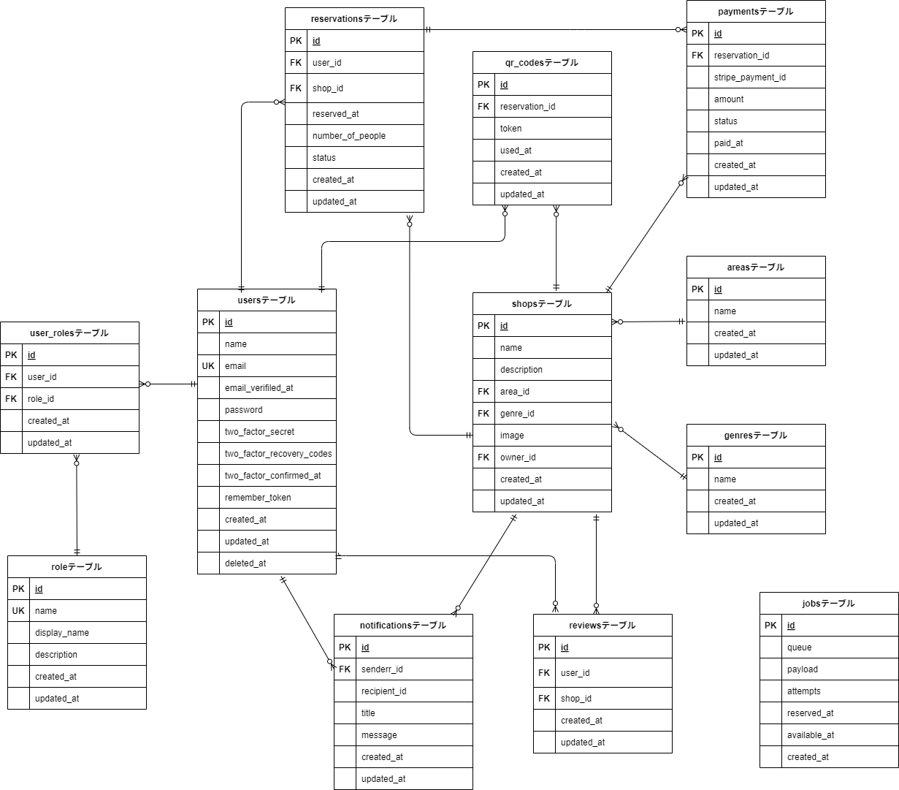

# rese-reservation

`rese-reservation` は、企業グループ内の飲食店専用の予約サービスです。  
外部予約プラットフォームに依存せず、手数料コストを削減しながら高機能な予約体験を提供することを目的としています。

## アプリケーション URL
http://18.177.35.226

## 🛠 主な機能

### 🔐 ユーザー関連

-   会員登録・ログイン・ログアウト（Fortify + メール認証）
-   ユーザー情報取得
-   お気に入り登録・削除
-   ユーザーの予約一覧取得・変更・削除

### 🍽 飲食店関連

-   一覧・詳細取得
-   エリア・ジャンル・店名による検索
-   店舗への評価（5 段階＋コメント）

### 📅 予約関連

-   予約追加・変更・削除
-   予約リマインダー（当日朝にメール通知）

### ⚙ 管理機能

-   権限：管理者 / 店舗代表者 / 一般ユーザー
-   店舗代表者：店舗情報管理・予約確認
-   管理者：代表者アカウント作成

### 💳 決済機能

-   Stripe を利用したオンライン決済

### 🖼 その他

-   ストレージによる店舗画像保存
-   QR コードによる来店チェック

## 作成した目的

模擬案件を通して実践に近い開発経験を積み、定義された要件を実装する能力を身につけること。

## 使用技術（実行環境）

-   PHP7.4
-   Laravel8.83.27
-   MySQL8.0.26

## テーブル設計

## ER 図



## 環境構築

### **1.リポジトリのクローン**

GitHub からプロジェクトをローカル環境にクローンします。

```
git clone https://github.com/chiemi123/rese-reservation
```

```
cd rese-reservation
```

### **2.Docker 環境のセットアップ**

Docker コンテナの起動
以下のコマンドで Docker コンテナを起動します。

```
docker-compose up -d --build
```

### **3.Laravel のセットアップ**

以下のコマンドで php コンテナにログインします。

```
docker-compose exec php bash
```

Laravel パッケージのインストール
以下のコマンドで Laravel パッケージのインストールをします。

```
composer install
```

.env ファイルを作成
プロジェクトルートに .env ファイルを作成し、.env.example をコピーします。

```
cp .env.example .env
```

### **4.アプリケーションキーの作成**

以下のコマンドでアプリケーションキーを生成します。

```
php artisan key:generate
```

### **5.マイグレーションの実行**

以下のコマンドでデータベースのマイグレーションを実行します。

```
php artisan migrate
```

マイグレーションの実行後、ブラウザで以下にアクセスできるか確認します。

http://localhost

権限エラーが発生する場合は、以下のコマンドを実行します。

```
sudo chmod -R 777 *
```

### **6.シーダーの実行**

以下のコマンドでシーダーを実行します。

```
php artisan db:seed
```

## 🔑 認証機能について

本アプリケーションでは、ユーザー認証の仕組みに [Laravel Fortify](https://laravel.com/docs/fortify) を使用しています。

### 使用バージョン

-   Laravel Fortify v1.19.1

### 主な機能

-   ログイン・新規登録
-   パスワードのリセット
-   メールアドレス認証（オプション）

### 導入手順

Fortify は `composer install` 実行時に自動でインストールされます。  
また、環境構築時にデータベースが適切にセットアップされていれば、追加の設定は不要です。

## 🔑 テストアカウント情報（ログイン用）

以下のアカウントを使用して、それぞれの権限でログインが可能です。

### 👤 一般ユーザー

-   **メールアドレス**: `user@example.com`
-   **パスワード**: `password123`

### 🏪 店舗代表者

-   **メールアドレス**: `owner@example.com`
-   **パスワード**: `password123`

### 👑 管理者

-   **メールアドレス**: `admin@example.com`
-   **パスワード**: `password12345`

## **商品画像の保存仕様**

本アプリでは、出品された商品の画像は **Laravel のストレージ（storage フォルダ）** に保存されます。  
デフォルトでは `storage/app/public/item_images` に画像が格納され  
`public/storage` にシンボリックリンクを作成することで、Web からアクセス可能になります。

#### **1. 画像の保存先**

| ディレクトリ                      | 説明                               |
| --------------------------------- | ---------------------------------- |
| `storage/app/public/item_images/` | アップロードされた画像の保存場所   |
| `public/storage/item_images/`     | Web アクセス用のシンボリックリンク |

シンボリックリンクの作成

画像を public ディレクトリからアクセス可能にするために、以下のコマンドを実行してください。

```
php artisan storage:link
```

## MailHog のセットアップ（開発環境用メール送信）

MailHog を使用すると、開発環境で送信されるメールをローカルで確認できます。

MailHog の起動  
MailHog は docker-compose up -d の時点で起動しています。  
ブラウザで以下にアクセスすると、送信されたメールを確認できます。

http://localhost:8025

.env のメール設定
.env ファイルを以下のように変更します。

```env

MAIL_MAILER=smtp
MAIL_HOST=mailhog
MAIL_PORT=1025
MAIL_USERNAME=null
MAIL_PASSWORD=null
MAIL_ENCRYPTION=null
MAIL_FROM_ADDRESS="example@example.com"
MAIL_FROM_NAME="${APP_NAME}"

```

その後、Docker コンテナを以下のコマンドで再起動します。

```
docker-compose restart
```

アプリケーションの起動

nginx / Apache を使用する場合

```
docker-compose up -d
```

ブラウザで http://localhost にアクセスしてください。

php artisan serve を使用する場合

```
docker-compose exec app php artisan serve --host=0.0.0.0 --port=8000
```

ブラウザで http://localhost:8000 にアクセスしてください。

## Stripe 決済のセットアップ

### **1. Stripe アカウントを作成**

Stripe の API キーを取得するには、まず **Stripe の公式サイトでアカウントを作成** する必要があります。

🔹 **Stripe 公式サイト:** [https://dashboard.stripe.com/register](https://dashboard.stripe.com/register)

1. 上記のリンクから **Stripe アカウントを作成**
2. [Stripe ダッシュボード](https://dashboard.stripe.com/) にログイン
3. **「開発者」 → 「API キー」** から **「公開可能キー」 (`STRIPE_KEY`)** と **「シークレットキー」 (`STRIPE_SECRET`)** を取得

### **2. `.env` に Stripe の API キーを設定**

Stripe ダッシュボード で 公開可能キー と シークレットキー を取得し、.env に設定します。

```ini

STRIPE_KEY=your_stripe_publishable_key
STRIPE_SECRET=your_stripe_secret_key
STRIPE_WEBHOOK_SECRET=your_stripe_webhook_secret

```

STRIPE_WEBHOOK_SECRET の取得方法  
以下のコマンドを実行し、Webhook のリスニングを開始します。

```
docker exec -it stripe_cli stripe listen --forward-to http://nginx/webhook/stripe
```

実行すると、以下のようなメッセージが表示されます。

```
> Ready! You are using Stripe API Version [2025-01-27.acacia].
Your webhook signing secret is whsec_xxxxxxxxxxxxxxxxxxxxxxxx
(^C to quit)
```

この whsec\_ から始まる値（whsec_xxxxxxxxxxxxxxxxxxxxxxxx）を .env にコピーします。

その後、Docker コンテナを以下のコマンドで再起動します。

```
docker-compose restart
```

または、以下のコマンドを実行してください。

```
docker-compose up -d
```

### **3. Stripe のライブラリがインストールされているか確認する**

以下のコマンドを実行し、`stripe/stripe-php` がインストール済みであることを確認してください。

```
docker-compose exec php composer show stripe/stripe-php
```

もし stripe/stripe-php が表示されない場合は、以下のコマンドでインストールしてください。

```
docker-compose exec php composer require stripe/stripe-php:^12.0
```

### **4.stripe のテスト環境**

Docker コンテナ内で stripe login を実行します。  
初回のみ Stripe にログインしてください。ブラウザが開くので、認証を行います。

```
docker exec -it stripe_cli stripe login
```

以下のコマンドで、Webhook のリスニングを開始します。

```
docker exec -it stripe_cli stripe listen --forward-to http://nginx/webhook/stripe

```

以下のコマンドで、Webhook のテストを実行します。

```
docker exec -it stripe_cli stripe trigger checkout.session.completed
```

#### **1.クレジットカード決済のテスト**

Stripe のテスト環境では、以下のカード番号を使用して決済テストができます。

| カード番号          | カード種別 | 成功 or 失敗        |
| ------------------- | ---------- | ------------------- |
| 4242 4242 4242 4242 | Visa       | ✅ 成功             |
| 4000 0000 0000 0002 | Visa       | ❌ 失敗（決済拒否） |
| 5555 5555 5555 4444 | Mastercard | ✅ 成功             |


## メール送信・リマインダー機能
### メール送信機能
本アプリでは以下のメール送信機能を実装しています：

ユーザー登録時の確認メール送信（Laravel Fortify）

ユーザーが予約を行った際に予約完了メールを自動送信

### リマインダーメール機能
リマインダーメールは「予約当日の朝（午前8時）」に、該当ユーザーへ自動で送信されます。
Laravelのスケジューラー機能とキューシステム（jobs テーブル）を活用し、以下のように構築されています：

#### 実装手順
#### 1.Mailable クラスの作成

以下のコマンドで予約リマインダーメールのテンプレートを作成します：

```
php artisan make:mail ReservationReminder --markdown=emails.reminder
```

作成された app/Mail/ReservationReminder.php にて、メール件名・本文などを定義します。

#### 2.カスタムコマンドの作成

リマインダー送信用の Artisan コマンドを作成します：

```
php artisan make:command SendReservationReminders
```

作成された app/Console/Commands/SendReservationReminders.php にて、以下のように処理を記述します：

「明日予約のあるユーザー」を抽出

各ユーザーにリマインダーメールを送信（Mail::to()->queue() を使用）

#### 3.スケジューラーへの登録

App\Console\Kernel.php に以下を追加し、毎朝8時に自動実行されるように設定します：

```
$schedule->command('reservations:send-reminders')->dailyAt('08:00');
```

#### 4.キューの起動

メール送信はキューを利用するため、以下のコマンドでキューワーカーを起動してください：

```
php artisan queue:work
```

※ jobs テーブルがマイグレーション済みである必要があります。

🧪 開発環境でのメール確認（MailHog）
開発中のメール送信は、MailHog を使用してローカル環境で確認できます。
以下のURLにアクセスすることで、送信されたメールをブラウザ上で閲覧可能です：

http://localhost:8025